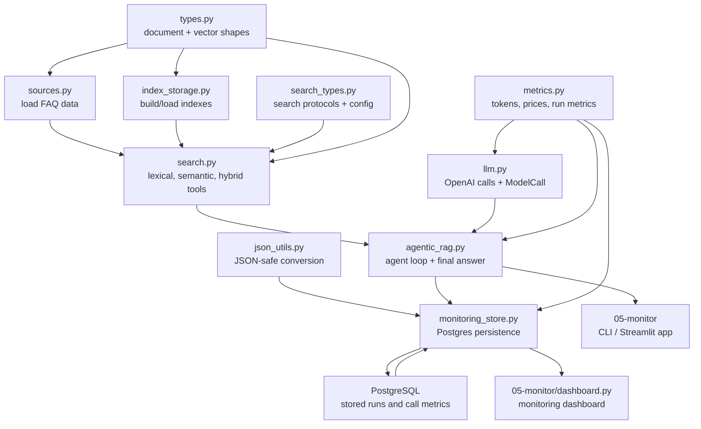

# RAG Architecture

This repo keeps the RAG system small, typed, and explicit. The key idea is that
each layer owns one responsibility: load data, search it, call the model, collect
metrics, or run the agent loop.



## The Pieces

`types.py` defines shared shapes: generic documents, FAQ documents, lesson
documents, ground-truth records, and embedding vectors. These are the low-level
types other modules agree on.

`sources.py` loads raw source data. Today it loads the course FAQ JSON and casts
the untyped HTTP response into typed FAQ records.

`search_types.py` defines search contracts. It uses `Protocol` so third-party
indexes like `minsearch` and `sqlitesearch` can satisfy our interfaces without
custom adapters. It also owns lexical and semantic search configuration.

`index_storage.py` builds or loads concrete indexes. This module knows about
backend libraries and persistence. Callers do not need to know whether the index
is in memory or SQLite-backed.

`search.py` exposes the search tools used by the rest of the system. It supports:

- lexical search with field boosts and filters;
- semantic search with an encoder and vector index;
- persisted or in-memory backends;
- hybrid search through reciprocal rank fusion.

All search tools implement the same `SearchTool[TDocument]` interface:

```python
def search(self, query: str) -> list[TDocument]
```

That lets the agent use lexical, semantic, or hybrid retrieval without changing
its own logic.

## Model Calls

`llm.py` is the model boundary. It owns:

- `DEFAULT_MODEL`;
- `ModelInput`, the shared typed contract for request items and prior model output;
- `call_llm` for normal Responses API calls;
- `call_structured_llm` for parsed structured outputs;
- `ModelCall[T]`, the small envelope returned by both functions.

`ModelCall[T]` bundles the model result with the metrics for that exact request:

```python
model_call = call_llm(...)
response = model_call.result
metrics = model_call.metrics
```

For structured calls, the same wrapper stays type-safe:

```python
model_call = call_structured_llm(..., output_type=Questions)
questions = model_call.result.questions
```

That generic `T` is what lets one helper return either an OpenAI `Response` or a
parsed Pydantic object while keeping the metrics contract the same.

The agent imports `ModelInput` rather than defining its own message-history
shape. The contract includes both parameter-shaped request items and previous
`response.output` items because the Responses API accepts both when a
conversation continues. The SDK annotation is narrower, so `llm.py` isolates
that mismatch at the API boundary.

## Metrics

`metrics.py` contains monitoring data, not control flow.

`ModelCallMetrics` records one model request: model name, tokens, cached tokens,
reasoning tokens, duration, completion time, and price.

`AgentRunMetrics` records one full agent run: all model-call metrics, tool-call
count, total duration, and aggregate token/cost properties.

`UsagePrice` stores model-call cost in USD. `calculate_price` uses the local pricing
table, and `validate_model_pricing` fails before a model call if we do not know
how to price that model.

The important split is:

```text
llm.py      measures one model call
metrics.py  stores and aggregates measurements
agentic_rag.py collects per-call metrics into one run
monitoring_store.py persists completed runs and call metrics
```

`json_utils.py` converts run history and other model objects into JSON-safe
values. That keeps the Streamlit renderer and the database layer from each
re-implementing the same conversion logic.

## Agent Runs

`agentic_rag.py` owns the RAG workflow.

`AgenticRAG` receives a `SearchTool[TDocument]`, an OpenAI client, instructions,
and a mode:

- `simple`: search once, then ask the model with the retrieved context;
- `agentic`: let the model call the search tool until it has enough context.

The agent does not keep cumulative mutable usage state. Each call to
`find_and_reply` returns an `AgentRun`:

```python
run = rag.find_and_reply(question)
answer = run.answer
cost = run.metrics.total_cost_usd
history = run.message_history
```

This keeps a run self-contained. It also makes Streamlit caching safe: the app
can cache the assistant and still keep each answer, history, and metrics tied to
the specific user request.

## Persistence

`monitoring_store.py` writes completed `AgentRun` objects to PostgreSQL and reads
them back as typed monitoring summaries. The app persists a run after the answer
is already available, so a database problem does not block the user from seeing
the result.

The store keeps two tables:

- `agent_runs` for the run-level summary and full message history;
- `model_call_metrics` for each individual model call inside the run.

`05-monitor/dashboard.py` presents the stored data separately from the chat. It
shows overall usage, cost and latency, recent trends, and a drill-down into the
model calls and message history for one run.

## Why The Types Matter

The generic document type keeps retrieval reusable:

```python
SearchTool[FAQDocument]
SearchTool[LessonDocument]
AgenticRAG[FAQDocument]
```

The generic model-call wrapper keeps model outputs reusable:

```python
ModelCall[Response]
ModelCall[Questions]
```

The result is a small set of interchangeable parts. Search backends can change,
structured outputs can change, and app surfaces can change, while the agent loop
and monitoring contract stay stable.
